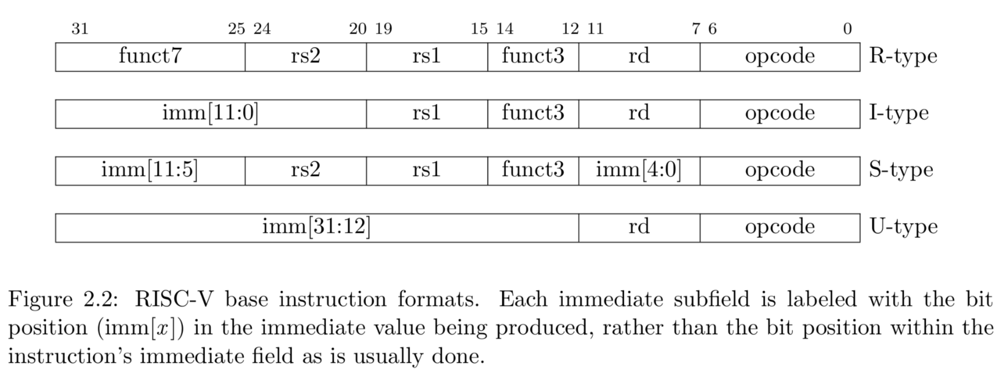
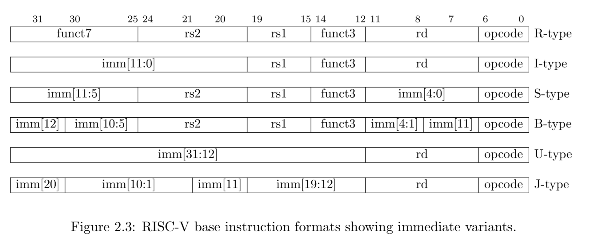
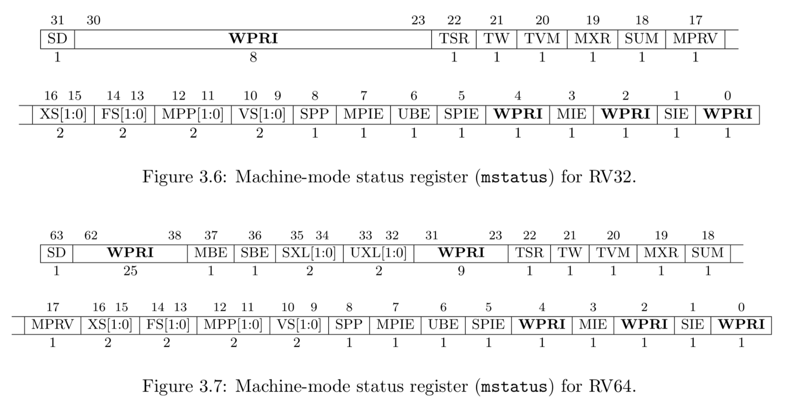

# PA1 实验报告
前面没写，就写一下必答题吧。  

## 程序是个状态机
1 + 2 + ... 100 指令序列。需要更新的状态包括：PC, r1, r2 所以用三元组：`(PC, r1, r2)` 来表示程序所有的状态。  

``` asm
1: mov r1, 0
2: mov r2, 0
3: inc r2
4: add r1, r2
5: jmp 3
```


初始状态 (0, x, x) 此处 x 表示未初始化，程序 PC=0 处的指令是 `mov r1, 0` 执行完 PC 会指向下一条指令，因此下一个状态是：`(1, 0, x)`
```
(0, x, x) -> (1, 0, x)  -> (2, 0, 0)  -> (3, 0, 1)->
(4, 1, 1) -> (5, 1, 1)  -> (3, 1, 2)  -> (4, 3, 2)->
(5, 3, 2) -> (3, 3, 3)  -> (4, 6, 3)  -> (5, 6, 3)->
             (3, 6, 4)  -> (4, 10, 4) -> (5, 10, 4) ->
             (3, 10, 5) -> (4, 15, 5) -> (5, 15, 5) ->
             (3, 15, 6) -> (4, 21, 6) -> (5, 21, 6) ->
             (3, 21, 7) -> (4, 28, 7) -> (5, 28, 8) ->
...
            (3, 4851, 99) -> (4, 4950, 99) -> (5, 4950, 99) ->
            (3, 4950, 100)-> (4, 5050, 100)
```

## 理解基础设施
略  

## RTFM
### Q: riscv32有哪几种指令格式?  
A: riscv32 包含四种指令格式(R/I/S/U)，所有指令长度均为固定是 32 位，且必须在内存中按四字节边界对齐。  



基于立即数处理方式的不同，指令格式还有另外两种变体(B/J)：  



所以实际是 6 种指令格式：  

- R
- I
- S
- B
- U
- J

### Q: LUI指令的行为是什么?  
A: 首先，LUI 是 Load Upper Immediate 的简称，即加载高位立即数。LUI 将 U 型立即数的值放置到目标寄存器 `rd` 的高 20 位种，并将其低 12 位填充为 0。用于构造 32 位常数。  

### Q:mstatus寄存器的结构是怎么样的?
A:  mstatus 是 MXLEN 位的可读可写寄存器。用于跟踪和控制 hart 的当前运行状态。  



- `MIE` 和 `SIE` 为全局中断使能位，这些位用于确保当前特权模式下与中断处理程序相关操作的原子性。  
    当 hart 在特权模式 x 下运行，若 xIE=1 则全局中断使能，若 xIE=0，则全局中断禁用。太多不想写了，后面补……
- 为了支持嵌套 trap，每个能响应中断的特权模式 x 都拥有一个两级中断使能位和特权模式堆栈。`xPIE` 用于保存 trap 发生前生效的中断使能位的值，`xPP` 保存之前的特权模式……  
- `MPRV` 位用于修改有效特权模式，即加载和存储指令执行所处的特权级别。  
- `MXR` 位用于修改加载指令访问虚拟内存时的特权权限。  
……  

文档好长，位段太多太复杂了，不看。  

## shell 命令
Q:完成PA1的内容之后, nemu/目录下的所有.c和.h和文件总共有多少行代码? 你是使用什么命令得到这个结果的? 和框架代码相比, 你在PA1中编写了多少行代码? (Hint: 目前pa0分支中记录的正好是做PA1之前的状态, 思考一下应该如何回到"过去"?) 你可以把这条命令写入Makefile中, 随着实验进度的推进, 你可以很方便地统计工程的代码行数, 例如敲入make count就会自动运行统计代码行数的命令. 再来个难一点的, 除去空行之外, nemu/目录下的所有.c和.h文件总共有多少行代码?  

有 6082 行代码。命令：  
``` bash
find . \( -name "*.c" -o -name "*.h" \) -not -path "./tools/*" -exec wc -l {} +
```


我在 pa1 编写了 653 行代码。  

除去空行外， nemu 目录下所有 .c 和 .h 文件总共有 5253 行代码：  

``` bash
find . \( -name "*.c" -o -name "*.h" \) -not -path "./tools/*" -exec cat {} + | grep -v '^[[:space:]]*$' | wc -l
```

## PTFM
Q: 打开nemu/scripters/build.mk文件, 你会在CFLAGS变量中看到gcc的一些编译选项. 请解释gcc中的-Wall和-Werror有什么作用? 为什么要使用-Wall和-Werror?  

``` makefile
CFLAGS  += -fPIC -fvisibility=hidden
CFLAGS  := -O2 -MMD -Wall -Werror $(INCLUDES) $(CFLAGS)
	@$(CC) $(CFLAGS) -c -o $@ $<
	@$(CXX) $(CFLAGS) $(CXXFLAGS) -c -o $@ $<
```

`-Wall` 即 all-warnings。会启用所有的警告。  
`Werror` 将所有的警告视为 error。  
