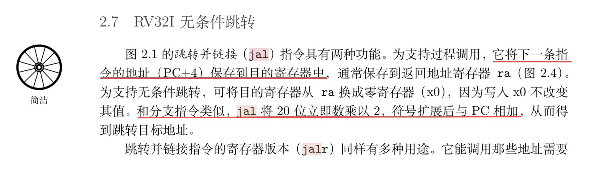
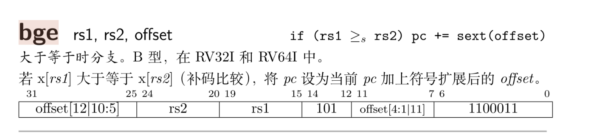

# PA2 实验报告

## 译码宏噩梦

在 /nemu/src/isa/riscv32/inst.c 的 `static int decode_exec(Decode *s)` 开始进行译码。  
主要是一堆宏嵌套，位运算很恶心人。nemu 用的模式匹配来匹配指令。  

关键就在于从 `s->isa->inst` 取到指令。开始：  
``` c
INSTPAT_START();
INSTPAT("??????? ????? ????? ??? ????? 00101 11", auipc, U, R(rd) = s->pc + imm);
INSTPAT("??????? ????? ????? 100 ????? 00000 11", lbu, I, R(rd) = Mr(src1 + imm, 1));
INSTPAT("??????? ????? ????? 000 ????? 01000 11", sb, S, Mw(src1 + imm, 1, src2));

INSTPAT("0000000 00001 00000 000 00000 11100 11", ebreak, N, NEMUTRAP(s->pc, R(10))); // R(10) is $a0
INSTPAT("??????? ????? ????? ??? ????? ????? ??", inv, N, INV(s->pc));
INSTPAT_END();
```

我实在是无法抽离开这么多宏的跳转嵌套，就从 INSTPAT 入手。写下 auipc 的匹配。  

``` c
    INSTPAT("??????? ????? ????? ??? ????? 00101 11", auipc, U, R(rd) = s->pc + imm);
```
要匹配右边的 0010111 来确定是 auipc 指令。  
INSTPAT 的结构为： `INSTPAT(模式字符串, 指令名称, 指令类型, 指令执行操作);` 可以从这里知道这条指令的作用：把 pc 和 立即数相加存到 rd 寄存器。  

然后 INSTPAT 是这样的：  
``` c
#define INSTPAT(pattern, ...)                                                                                          \
    do                                                                                                                 \
    {                                                                                                                  \
        uint64_t key, mask, shift;                                                                                     \
        pattern_decode(pattern, STRLEN(pattern), &key, &mask, &shift); /* 计算 key mask shift */                       \
        if ((((uint64_t)INSTPAT_INST(s) >> shift) & mask) == key)      /*模式匹配*/                                    \
        {                                                                                                              \
            INSTPAT_MATCH(s, ##__VA_ARGS__);                                                                           \
            goto *(__instpat_end);                                                                                     \
        }                                                                                                              \
    } while (0)
```

啊这又要问了，pattern_decode 是啥，INSTPAT_INST 是啥，INSTPAT_MATCH 又是啥…… 头大！  
在 decode_exec 最开始声明了两个宏：  
``` c
#define INSTPAT_INST(s) ((s)->isa.inst)
#define INSTPAT_MATCH(s, name, type, ... /* execute body */)                                                           \
    {                                                                                                                  \
        int rd = 0;                                                                                                    \
        word_t src1 = 0, src2 = 0, imm = 0;                                                                            \
        decode_operand(s, &rd, &src1, &src2, &imm, concat(TYPE_, type));                                               \
        __VA_ARGS__;                                                                                                   \
    }
```

INSTPAT_INST 就是把指令抽出来，仅此而已。 pattern_decode 计算 key mask shift。  
pattern_decode 是内联函数，里面有点复杂，不展开，反正 key, mask, shift 进去再出来就算好了。  
- `key` 就是那个指令码
- `mask` 是掩码，用于提取操作码那几位
- `shift` 表示距离最低比特位的数量，用于做偏移方便用 & mask 取出指令码。  

核心就在于 INSTPAT 宏的:  

``` c
((((uint64_t)INSTPAT_INST(s) >> shift) & mask) == key)
```

其实这一顿 ` s >>shift & mask` 操作就很好看懂了，与 key 匹配，如果可以就进入 INSTPAT_MATCH 匹配，之后 decode_operand 根据指令类型再做提取。指令类型在 RISC-V 手册写着。  

回到 INSTPAT，我必须再贴一下 `auipc` 的那一行：  
``` c
INSTPAT("??????? ????? ????? ??? ????? 00101 11", auipc, U, R(rd) = s->pc + imm);
```

仔细看最后一个参数就是 auipc 所做的对寄存器的操作！  
这可是个了不得的事情，因为 INSTPAT 实际除了第一个字符串之外都是在 ... 的可变参数下。INSTPAT_MATCH 取了点，到最后只剩下 `R(rd) = s-> pc + imm` 没有用到。也就是说：  

``` c
#define INSTPAT_MATCH(s, name, type, ... /* execute body */)                                                           \
    {                                                                                                                  \
        int rd = 0;                                                                                                    \
        word_t src1 = 0, src2 = 0, imm = 0;                                                                            \
        decode_operand(s, &rd, &src1, &src2, &imm, concat(TYPE_, type));                                               \
        __VA_ARGS__;                                                                                                   \
    }
```

这里的 __VA_ARGS__ 就是我们指令的命令！我们把执行的操作也做了。  
天哪！终于搞懂了一点点……  

## 适配 dummy.c
dummy.c 就是一个空函数，最简单的 C 程序了。  

需要实现如下的指令。  
``` c
INSTPAT("??????? ????? ????? 000 ????? 00100 11", addi, I, R(rd) = src1 + imm);
INSTPAT("??????? ????? ????? 000 ????? 11001 11", jalr, I, R(rd) = s->pc + 4; s->dnpc = src1 + imm);
INSTPAT("??????? ????? ????? ??? ????? 11011 11", jal, J, R(rd) = s->pc + 4; s->dnpc = s->pc + imm);
INSTPAT("??????? ????? ????? 010 ????? 01000 11", sw, S, Mw(src1 + imm, 4, src2));
```

翻 RISC-V 开放架构设计之道这本书看一些实现，还有 [https://ai-embedded.com/risc-v/riscv-isa-manual/](https://ai-embedded.com/risc-v/riscv-isa-manual/)。  

比如 jal：  

  

另外 jal 是 J 类型的指令，还要实现 immJ 宏，RISC-V 开放架构设计之道的第 15、16 页写得比较清楚，需要做比较繁琐的位运算：  
``` c
#define immJ()                                                                                                         \
    do                                                                                                                 \
    {                                                                                                                  \
        *imm = SEXT(BITS(i, 31, 31), 1) << 20 | BITS(i, 30, 21) << 1 | BITS(i, 20, 20) << 11 | BITS(i, 19, 12) << 12;  \
    } while (0)
```

然后在 decode_operand 补上 TYPE_J：
``` c
case TYPE_J:
    immJ();
    break;
```

就可以了。主要是看指令的类型，指令的用法。以及，要善用 gdb attach 进程，给程序打断点，看结构体数据什么的很好用。总的来说，难度中上。  

## 适配 max.c
### `lw` 指令
``` asm
80000070:	000aa903          	lw	s2,0(s5)
```

从设计之道 16 页找到格式和类型，填上之后到 [https://www.cnblogs.com/sureZ-learning/p/18402849](https://www.cnblogs.com/sureZ-learning/p/18402849) 找到 lw 的操作，得到：  

``` c
INSTPAT("??????? ????? ????? 010 ????? 00000 11", lw, I, R(rd) = Mr(src1 + imm, 4));
```

### `bge` 指令
``` asm
80000084:	01255463          	bge	a0,s2,8000008c <main+0x64>
```

同上，但是 bge 是 B 类型指令。需要补下 immB 和 typeB。照着 immJ 改还是可以的：  

``` c
#define immB()                                                                                                         \
    do                                                                                                                 \
    {                                                                                                                  \
        *imm = SEXT(BITS(i, 31, 31), 1) << 12 | BITS(i, 30, 25) << 5 | BITS(i, 11, 8) << 1 | BITS(i, 7, 7) << 11;      \
    } while (0);
```

然后
```c
case TYPE_B:
    src1R();
    src2R();
    immB();
    break;
```

bge 判断是否`src1 >= src2` 如果是，就将 pc 加上立即数。反汇编把加好的地址 直接写了。  
``` c
INSTPAT("??????? ????? ????? 101 ????? 11000 11", bge, B, if (src1 >= src2) s->dnpc += imm);
```

有那么简单吗？  
补完所有指令后跑起来最后结果是:  HIT BAD TRAP  
问题就出来 bge:

  

bge 是有符号比较。所以 src1 和 src2 应该强制转换为有符号数：  
``` c
INSTPAT("??????? ????? ????? 101 ????? 11000 11", bge, B, if ((sword_t)src1 >= (sword_t)src2) s->dnpc = s->pc + imm);
```
这样才能通过。  

### `sub` 指令
### `seqz` 指令
在设计之道的 163 页讲 seqz 展开为 sltiu。在 165 页讲了 sltiu 的逻辑。  
``` c
INSTPAT("??????? ????? ????? 011 ????? 00100 11", sltiu, I, if (src1 < imm) R(rd) = 1; else R(rd) = 0); // seqz
```

…… 略  


